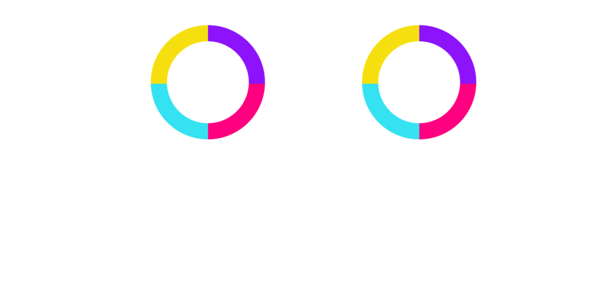
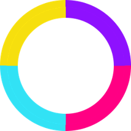

<h1> 
  Color Switch
   
</h1>
<i><b> A revamped game replica made by Divyansh Rastogi & Rupanshu Yadav </b></i>

  

<h2 align = "center">
   
  :zap: Implementation Description
  
</h2>
<h6 align = "right"><i> For a further detailed overview, refer <a href = "https://github.com/Team-60/ColorSwitch/blob/master/ColorSwitch.pdf">here</a> :mag: </i></h6>

 &nbsp; The UI/UX for the game is designed with JavaFX.  
 &nbsp; Implemented our own game-engine in JavaFx on bare canvas with
optimized game-play physics offering ultra smooth rendering.  
 &nbsp; Utilized FXML and JavaFx CSS to tailor a receptive game interface designed on Scene Builder.

 

<h2 align = "center"> 
   
  :book: Game Objective 
  
</h2>

 
  
  
  Encounter and pave your way through a variety of unique & challenging tri/quad-colored obstacles!   
  All seems fun & enticing but this may very well change when you escort a colored ball through these shapes!  
  <i> Keep bouncing, have fun and good luck! </i>

 

<h2 align = "center"> 
   
  :rocket: How to Run? 
   
</h2>
<h6 align = "right"><i> Current steps are supported on <a href = "https://www.jetbrains.com/idea/download/#section=windows">IntelliJ IDEA</a> :exclamation: </i></h6>

### :gear: Dependencies:
&emsp;  &nbsp; JDK 11 or higher &emsp; | &emsp; [___download___](https://www.oracle.com/in/java/technologies/javase-jdk15-downloads.html)  
&emsp;  &nbsp; JavaFX 11.0.1 or higher &emsp; | &emsp; [___download___](https://gluonhq.com/products/javafx/)  
### :wrench: Setting up IntelliJ IDEA:
&emsp;  &nbsp; JDK 11 or higher  
&emsp;  &nbsp; JavaFX 11.0.1 or higher  

 
<h2 align = "center"> 
   
  :stars: In-Game Snapshots
  
</h2>

 
<h4 align = "center"> :construction: <i>Work In Progress</i> :construction: </h4>

 
<h4 align = "center"> All contributions are welcomed! </h4>
