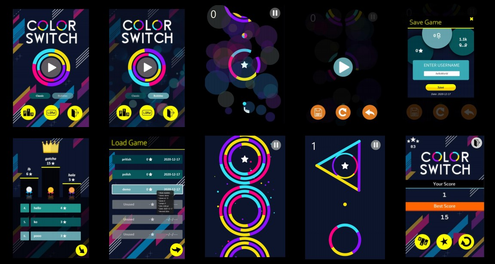

<p align = "center">
<h1> 
  Color Switch
   
</h1>
</p>
<i><b> A revamped game replica made by Divyansh Rastogi & Rupanshu Yadav </b></i>
<br><br>

🔎 &nbsp; [Implementation Description](https://github.com/Team-60/ColorSwitch/blob/master/README.md#-----zap-implementation-description--) /
[Game Objective](https://github.com/Team-60/ColorSwitch/blob/master/README.md#------book-game-objective---) /
[How To Run?](https://github.com/Team-60/ColorSwitch/blob/master/README.md#------rocket-how-to-run----) / 
[In-Game Snapshots](https://github.com/Team-60/ColorSwitch/blob/master/README.md#------stars-in-game-snapshots--)
<br>

#### 🎮 &nbsp; *Check out our gameplay [here](https://bit.ly/3bgOxZk)!* [**](https://github.com/Team-60/ColorSwitch/blob/master/README.md#------stars-in-game-snapshots--)

<h2 align = "center">
   
  :zap: Implementation Description
  
</h2>
<h6 align = "right"><i> For a further detailed overview, refer <a href = "https://github.com/Team-60/ColorSwitch/blob/master/ColorSwitch.pdf">here</a> :mag: </i></h6>
<p>
 &nbsp; The UI/UX for the game is designed with JavaFX. <br>
 &nbsp; Implemented our own game-engine in JavaFx on bare canvas with
optimized game-play physics offering ultra smooth rendering. <br>
 &nbsp; Utilized FXML and JavaFx CSS to tailor a receptive game interface designed on Scene Builder.
</p>
<br>

<h2 align = "center"> 
   
  :book: Game Objective 
  
</h2>
<p align = "center"> 
  
  
  Encounter and pave your way through a variety <i>(25+ !)</i> of unique & challenging tri/quad-colored obstacles! <br> 
  All seems fun & enticing but this may very well change when you escort a colored ball through these shapes! <br>
  <i><b> Keep bouncing, have fun and good luck! </b></i>
</p>
<br>

<h2 align = "center"> 
   
  :rocket: How to Run? 
   
</h2>
<h6 align = "right"><i> Current steps are supported on <a href = "https://www.jetbrains.com/idea/download/#section=windows">IntelliJ IDEA</a> :exclamation: </i></h6>

### :gear: Dependencies:
&emsp;  &nbsp; JDK 11 or higher &emsp; | &emsp; [___download___](https://www.oracle.com/in/java/technologies/javase-jdk15-downloads.html) <br>
&emsp;  &nbsp; JavaFX 11.0.1 or higher &emsp; | &emsp; [___download___](https://gluonhq.com/products/javafx/) <br>
&emsp;  &nbsp; Git &emsp; | &emsp; [___download___](https://git-scm.com/downloads) <br>

### :wrench: Setting up IntelliJ IDEA:
&emsp;  &nbsp; Install <a href = "https://www.jetbrains.com/idea/download/#section=windows"><b>IntelliJ IDEA</b></a> and follow basic setup guidelines <br>
&emsp;  &nbsp; Open a new project from ___existing source___, use ``` https://github.com/Team-60/ColorSwitch.git ``` as project source.<br>
&emsp;  &nbsp; <b> Set up project libraries for JavaFX </b> <br>
&emsp; &emsp;  &nbsp; Go to  ``` File > Project Structure > Project Settings > Libraries ``` <br> &emsp; &emsp;  &nbsp; Select ``` add a new Java library (+ icon) > select path to your JavaFx > "lib" folder``` <br>
&emsp;  &nbsp; <b> Adding VM options for run configurations </b> <br>
&emsp; &emsp;  &nbsp; Go under  ``` Run > Edit Configurations ``` <br>
&emsp; &emsp;  &nbsp; Add the following under *VM Options* <br> 
&emsp; &emsp; &emsp; ```-ea --module-path "$JAVAFX_LIB_PATH"  --add-modules javafx.controls,javafx.fxml,javafx.media``` <br>
&emsp;  &nbsp; Build the project :hammer: <br>
&emsp;  &nbsp; Go to ``` src/gameEngine/App.java ``` , select the file and press ``` right click > run ``` <br>

<br>
<h2 align = "center"> 
   
  :stars: In-Game Snapshots
  
</h2>


<br>
<h4 align = "center"> :construction: <i>Work In Progress</i> :construction: </h4>

<br>
<h4 align = "center"> All contributions are welcomed!  <br>
<h5 align = "center"> Drop us a star  if you found the project to be entertaining/helpful!  </h4>
<br><br>


<h6><i>
  ** The video might be laggy due to quality screen recording causing heavy load 😖 <br>
  &emsp; For experiencing a super smooth gameplay experience, <a href = "https://github.com/Team-60/ColorSwitch/blob/master/README.md#------rocket-how-to-run----">install & run</a> the game! 
</i></h6>
